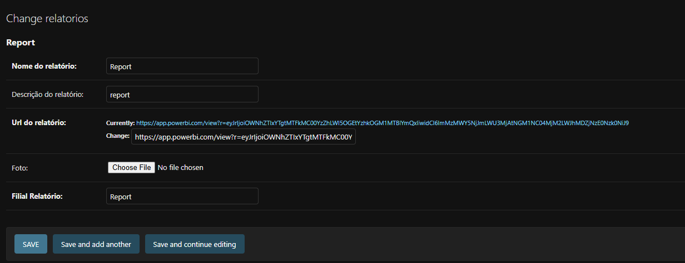

# Report power bi app

This project was made with django!

Go to https://www.djangoproject.com/ to know more about!

# Installation
In the root project, run:
```
pip install -r requirements.txt
python manage.py migrate
python manage.py runserver
```

Go to: http://127.0.0.1:8000/


# Create superuser
when you start a new project, there is no user login. 
Stop the local server Django service and run:
```
python manage.py createsuperuser

``` 

Insert the username and password and now you can Sing in.


# Add new Power BI report
Go to http://127.0.0.1:8000/admin/
In report_app section, go to: +add
Insert name, description, URL values



Now, the new PowerBI report will be in the home page.


